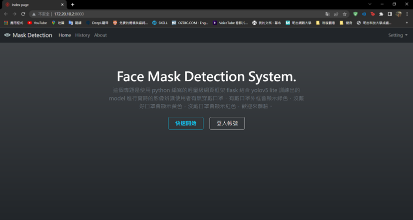
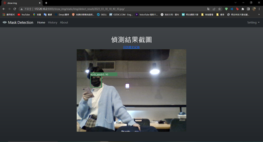
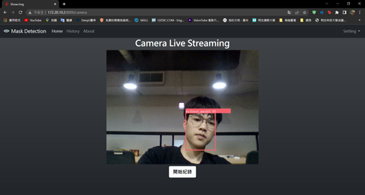

# 😷 Raspberry Pi AI Mask Detection System / 樹莓派 AI 口罩辨識系統

A lightweight **face mask detection system** based on **YOLOv5-Lite**, deployed using **Raspberry Pi 4** and **Flask web interface**.

輕量級的口罩辨識系統，基於 YOLOv5-Lite 模型，搭配 Raspberry Pi 4 與 Flask 架設網頁伺服器，可進行即時影像串流與資料記錄。

---

## 🔍 Project Overview / 專案簡介

This project uses a Raspberry Pi and USB camera to:
本專案使用 Raspberry Pi 與 USB 攝影機來：

- Detect faces and determine mask usage / 辨識人臉並判斷是否配戴口罩  
- Display detection results via Flask web interface / 透過 Flask 架設網頁顯示辨識畫面  
- Log detection results to a MySQL database / 將資料儲存於 MySQL 資料庫  
- User login for secure access / 登入機制，限定功能權限  

---

## 🧠 Features / 系統特色

- 👁 Real-time face and mask detection (YOLOv5-Lite) / 即時人臉與口罩偵測  
- 🔗 Web streaming via Flask / Flask 網頁串流顯示結果  
- 🧮 MySQL backend data logging / 以 MySQL 儲存辨識資料  
- 👤 Login system / 登入與帳號系統  
- 📩 GPIO warning / 未來可結合 GPIO 發出警報  

---

## 🧰 Tech Stack / 使用技術

| 功能區塊         | 使用技術                  |
|------------------|---------------------------|
| 裝置與平台       | Raspberry Pi 4 Model B    |
| 程式語言         | Python 3                  |
| 網頁後端         | Flask                     |
| 影像處理         | OpenCV + YOLOv5-Lite      |
| 資料庫           | MySQL                     |
| 資料標記工具     | labelImg                  |
| 作業系統         | Raspbian Lite             |

---

## 🧪 Model Training & Inference / 模型訓練與推論

- Three classes: `with_mask`, `without_mask`, `mask_weared_incorrect`  
  三大類口罩資料集
- Labeled in YOLO format / 以 YOLO 格式標註
- Train with `v5lite-s.pt` using custom config / 使用自定義設定與模型訓練
- Results streamed to browser / 推論結果可即時網頁顯示

---

## 🖼 System Architecture / 系統架構

```
[Camera] → [YOLOv5-Lite Inference] → [Flask Web UI]
                          ↓
                    [MySQL Logging]
```

<!--
---

## 🚀 How to Run / 如何執行

1. Clone the repository / 複製專案
   ```bash
   git clone https://github.com/your-repo/mask-detection-pi.git
   cd mask-detection-pi
   ```

2. Install dependencies / 安裝相依套件
   ```bash
   pip install -r requirements.txt
   ```

3. Run Flask server / 啟動 Flask 伺服器
   ```bash
   flask run
   ```

4. Access via browser / 使用瀏覽器開啟
   ```
   http://<raspberry-pi-ip>:5000
   ```
---

-->

## 📌 Future Work / 未來展望

- GPIO alarm and SMS notifications / 加入 GPIO 警報與簡訊通知  
- Mask-wearing history statistics / 口罩配戴歷史統計分析  
- Add attributes like age, gender / 屬性辨識功能（年齡、性別...）

<!--
---

## 👨‍💻 Contributors / 專案成員

- 江易澤 Yi-Ze Chiang  
- 吳家豪 Chia-Hao Wu  
- 林承旭 Cheng-Hsu Lin  
- **Advisor / 指導老師**：黃樹林教授

---
-->

## 📄 License / 授權聲明

此為明志科技大學電子工程系 111 學年度專題實務作品，僅供學術展示與教學使用。  
This project is part of the 2023 capstone at MCUT EE, intended for educational demonstration purposes.

---

## 🖼 Demo Screenshots / 系統示意圖

### 📌 Web Homepage / 網頁首頁


### 🧾 Detection History / 配戴口罩歷史紀錄


### ✅ With Mask Detected / 有戴口罩


### ❌ Without Mask Detected / 沒有戴口罩

